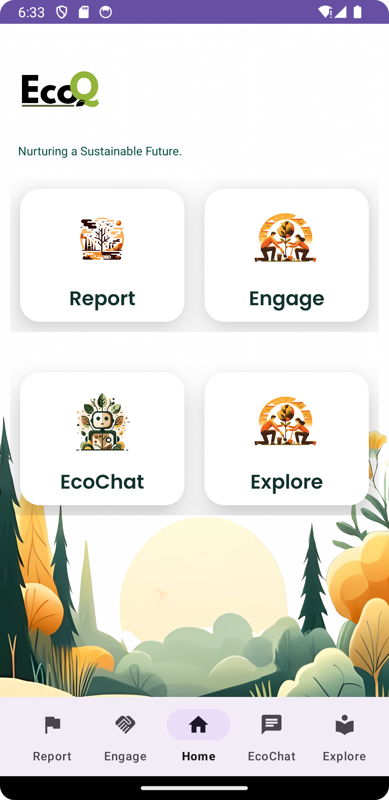
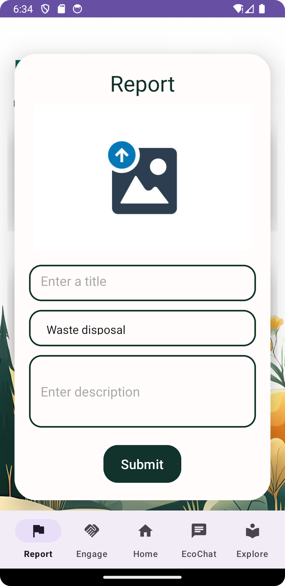
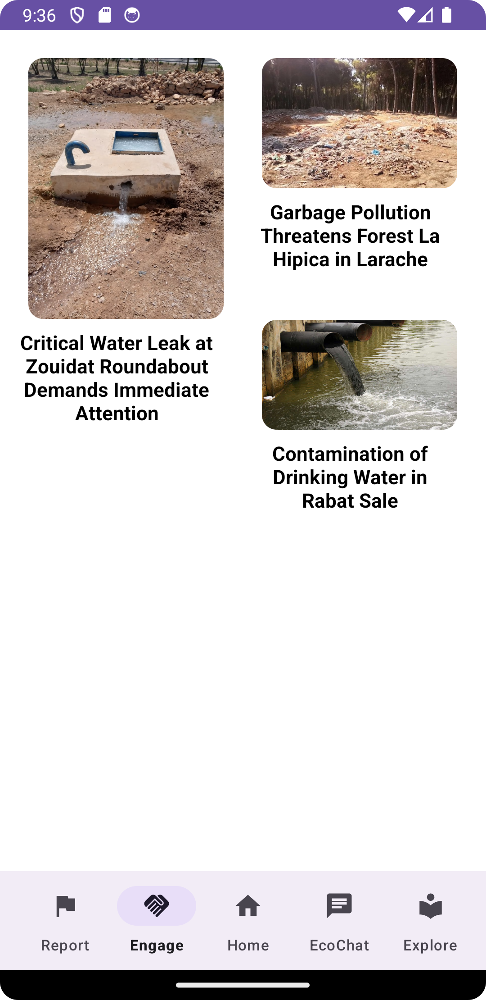
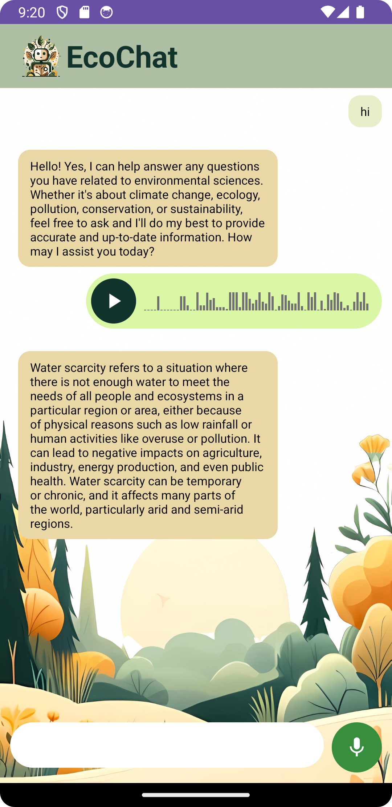

<p align="center"></p>

------
## Abstract
In response to the escalating environmental challenges of our time, fostering awareness and encouraging collective action are crucial steps toward a sustainable future. Our project, EcoQ, addresses this need by introducing a mobile app designed to empower individuals in contributing to environmental well-being. This app combines a user-friendly reporting interface for submitting environmental issues with community engagement features and an informative chatbot to answer environment-related queries, and promote eco-friendly practices. EcoQ is not just an app: it's a catalyst for positive change, encouraging users to play an active role in building a more sustainable world.

## Solution: EcoQ
Our Impact, Our Future: Can We Shift the Course?

EcoQ is a mobile application dedicated to fostering environmental awareness and facilitating community-driven initiatives. By providing users with a user-friendly "report" interface, EcoQ enables individuals to easily capture and report environmental concerns such as water wastage and improper waste disposal. This streamlines the reporting process, ensuring that problems are communicated promptly and accurately. Additionally, EcoQ features EcoChat, a helpful chatbot dedicated to answering environment-related questions.

|||||
|:-----------------------------------------------------:|:-----------------------------------------------------:|:------------------------------------------------------------:|:------------------------------------------------------------:|
| Home                                        | Report                          | Engage                                          | EcoChat                                          |


## Reproducibility Guide
- **For the server:**
Get the quatized mistral 7B from [mistral-7b-instruct-v0.2.Q4_K_M.gguf](https://huggingface.co/TheBloke/Mistral-7B-Instruct-v0.2-GGUF/tree/main)
```python
  python app.py
```
- To get your Docker image:
```sh
docker buildx  build -t local-genai:v1 .
```
```shell
docker run -p 1010:1010 local-genai:v1 
```
- To experiment with the Android app using Android Studio:
  - Setup the server.
  - Run the app in an emulator or on your phone.
